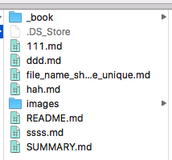

####gitbook的基本使用
 - 插入图片
   - 插入本地图片
     - 创建一个images文件夹和根目录一致
     - 把图片放到images里面，然后根据下面寻路径方式进行添加图片
     - 
   - 查入网络图片
     - 

 - 插入链接
     - [ahha](http://www.baidu.com/)
 - 表格

 - 导入代码
  ```objc

  + (NSArray *)constraintsWithVisualFormat:(NSString *)format
    options:(NSLayoutFormatOptions)opts
    metrics:(NSDictionary *)metrics
    views:(NSDictionary *)views;

  ````
